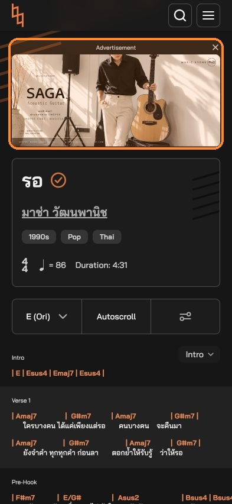
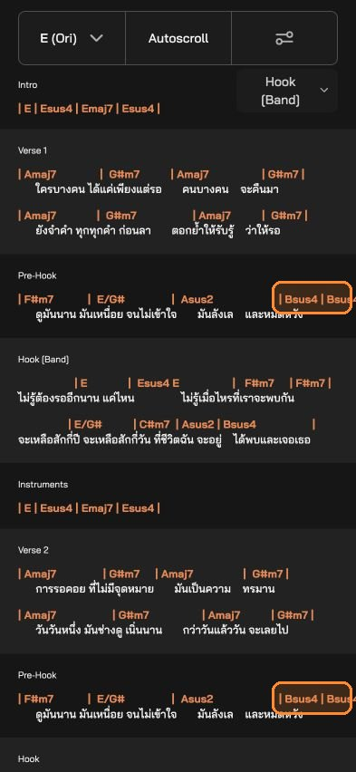
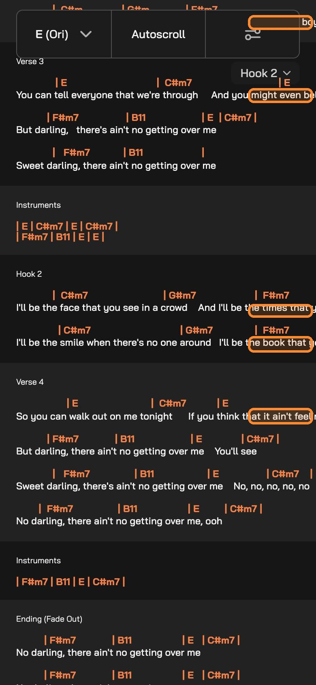
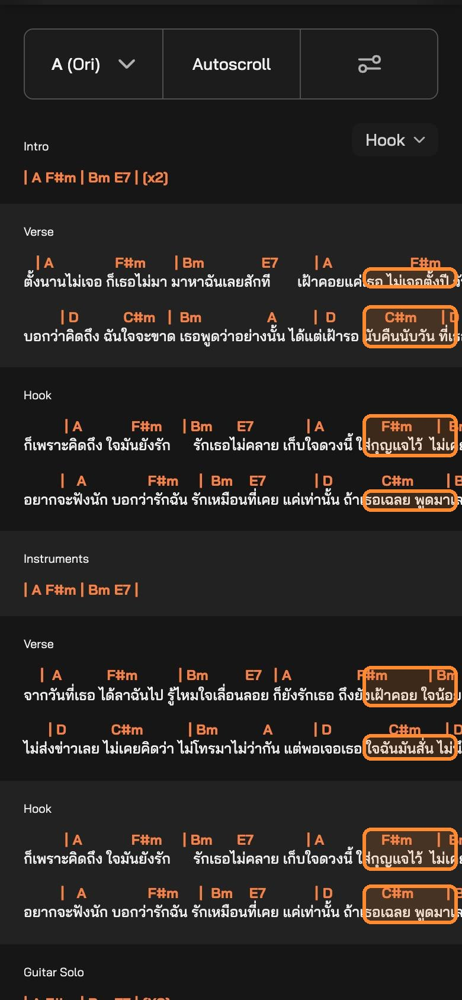
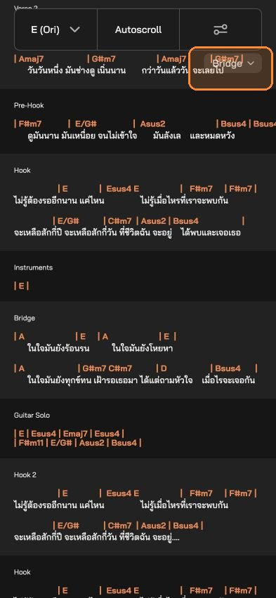
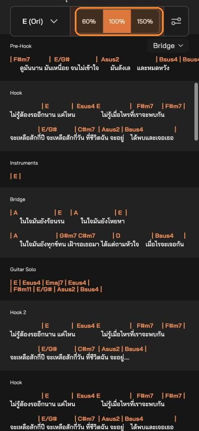
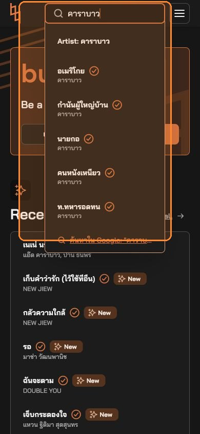
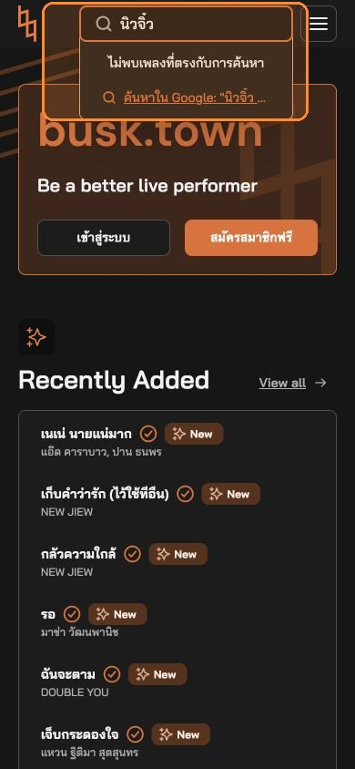
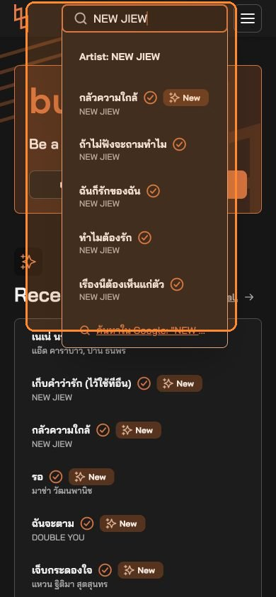
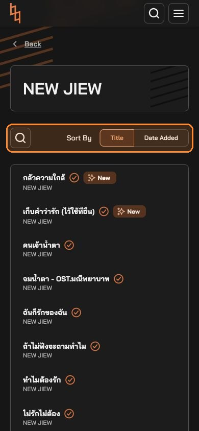

# A few notes on busk.town

Hi busk.town team,

Thank you for the site. The charts are a pleasure to play from: the chords sit with the words, the sections are labelled, and changing key is right there when I need it. I spent a little time on my phone the way I would at rehearsal, and noticed a few small things. I'm sharing them in case they're useful.

## The song could sit a little higher

The chart itself is easy to read. On the phone, a large ad sits above it, so the title and the first chords begin further down. When a friend sends me a link during practice, it would help if the song were the first thing on the screen. The ad could live a little further down the page.

## Some lines run past the edge of the phone

Sliding a line sideways does bring the rest into view. I just have to remember that extra move while I'm playing. If the line wrapped, or fitted the phone, I could keep singing.

In *รอ*, the last chord of the Pre-Hook, Bsus4, starts past the edge.

The words do this too. On most of the songs I opened, at least one lyric line continues off the screen. In *(There's) No Gettin' Over Me*, Hook 2 ends mid-word: "I'll be the book that y…"

In *(เก็บใจใส่) กุญแจ*, the verse and the hook do the same. "อยากจะฟังนัก บอกว่ารักฉัน…" stops around "พูดมาล".

I saw the same thing on songs such as *1001 (You're Lovely)*, *11 นาฬิกา*, and *200%*. This was at the default text size, on songs from the front page.

## The section menu sometimes rests on the chart

The section menu is handy for jumping around a long song. While I was reading *รอ*, the floating "Bridge" label sat on the last chord and the end of the lyric. If it stayed up with the other controls, the chart underneath would stay clear.

## A Pause label next to Autoscroll

Autoscroll is a nice touch when both hands are busy. Once it starts, the button becomes 60%, 100% and 150%. Tapping the speed that's already selected does pause the page. I found that by trying it. A Pause label beside the speeds would make it obvious when the singer stops for a moment.

## Finding an artist by either name

Search is quick when I type the name the way it's listed. A few artists I know by another spelling didn't come up. `carabao` was empty, while `คาราบาว` found the artist and the songs. The other way around as well: `นิวจิ๋ว` was empty, and `NEW JIEW` worked. I nearly assumed those songs weren't there. Matching the Thai name and the English name would help.

 

`carabao` is empty. `คาราบาว` works.

 

`นิวจิ๋ว` is empty. `NEW JIEW` works.

## Keeping a search when I come back

On NEW JIEW I searched `ไม่รัก`, sorted by Date Added, opened a song, and pressed Back. The search had cleared, and the list was every song again, sorted by title. If the search and the sort could stay as they were, comparing songs for a set would be a little easier.

 

## The three that would help me most

1. Let each line stay on the screen, chords and lyrics, and keep the section menu clear of the chart.
2. Show Pause on Autoscroll.
3. Find an artist from either spelling.

Thank you again for the care that's already in these charts. Happy to explain any of this if it would help.

Checked on 7 October 2026, in a phone-width browser, without an account. A shorter copy: [FEEDBACK-SUMMARY.md](FEEDBACK-SUMMARY.md).
