# busk.town feedback — from a musician’s point of view

Hey busk.town team, these suggestions look at the site through an ordinary musician’s eyes: a phone or iPad on a music stand, hands on an instrument, and no interest in working out how an app works. Each point has a screenshot and a clear ask.

**The short version:**

1. **Keep every chord readable.** Ads, clipped lines and floating controls get in the way of playing.
2. **Make the playing controls obvious.** Pausing the page or finding a chord shape should take one tap.
3. **Help me get a set ready.** Find artists by familiar names, keep my search when I go back, and show me how to start a setlist.

---

## The main point: let me keep playing

Once a song starts, every extra tap means taking a hand off the instrument. Give me the words, the next chord and a few controls I can recognise immediately. The rest can wait until rehearsal is over.

## Priorities at a glance

| Order | Area | What would help most |
|---|---|---|
| [P1](#p1-reading-the-song) | Reading the song | A clear playing view; no clipped or covered chords |
| [P2](#p2-controls-while-playing) | Controls while playing | A visible Pause button, understandable tools and nearby chord shapes |
| [P3](#p3-finding-and-preparing-songs) | Finding and preparing songs | Familiar artist names, helpful search recovery and a clear setlist entry point |
| [P4](#p4-getting-ready-to-use-it) | Getting ready to use it | A clear sign-up route and an explanation of what needs internet |

These are groups in the order I would tackle them, not a claim that every point is a critical bug.

---

## P1. Reading the song

### 1.1 Give the song more of the screen

**The problem:** a large ad sits above the song, and the first-visit Tools introduction covers the opening chords.

 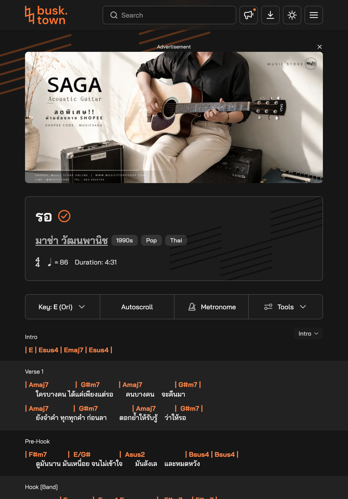

**Why it hurts:** a song link from a bandmate should open ready to play.

**My ask:** add a playing view that puts the song first and keeps ads and introductions outside the reading area. Keep recommendations and shopping below it.

### 1.2 Never cut off a chord at the phone edge

**The problem:** long chord lines in *รอ* extend past the phone’s right edge in Full layout. The earlier capture below shows the end of the line cut off.

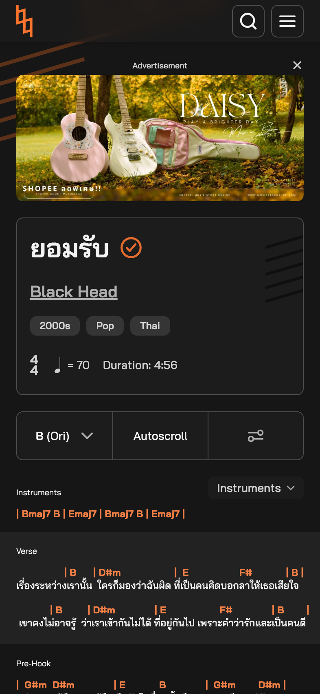

**Why it hurts:** guessing the missing chord is not something a player should have to do.

**My ask:** wrap the line or fit its bars to the screen automatically, including after increasing the text size.

### 1.3 Keep the section picker off the music

**The problem:** while scrolling through *รอ*, the floating “Bridge” picker covers the final G#m7 chord and the end of a lyric. This happens even to content that fits on the screen.

**Why it hurts:** looking up for the next chord should not mean moving the page to uncover it.

**My ask:** give the picker its own space beside the toolbar, clear of the chords and lyrics.

---

## P2. Controls while playing

### 2.1 Show me how to pause Autoscroll

**The problem:** starting Autoscroll replaces its label with “60%”, “100%” and “150%”. Tapping the selected percentage pauses it, but nothing on screen says that.

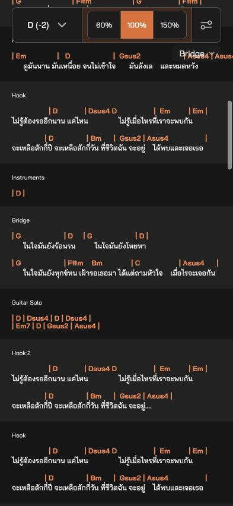

**Why it hurts:** if the singer repeats a line or talks to the audience, I need to stop the page immediately.

**My ask:** keep a labelled Pause/Resume button beside the speed choices.

### 2.2 Make the tools explain themselves

**The problem:** the phone’s Tools control is an unlabelled icon. Inside it, “True” is an unclear name for a chord version. Some switches, including Section name in the tested layout, are disabled without explaining why.

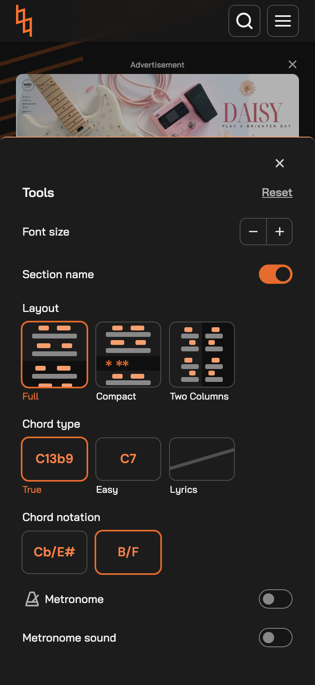 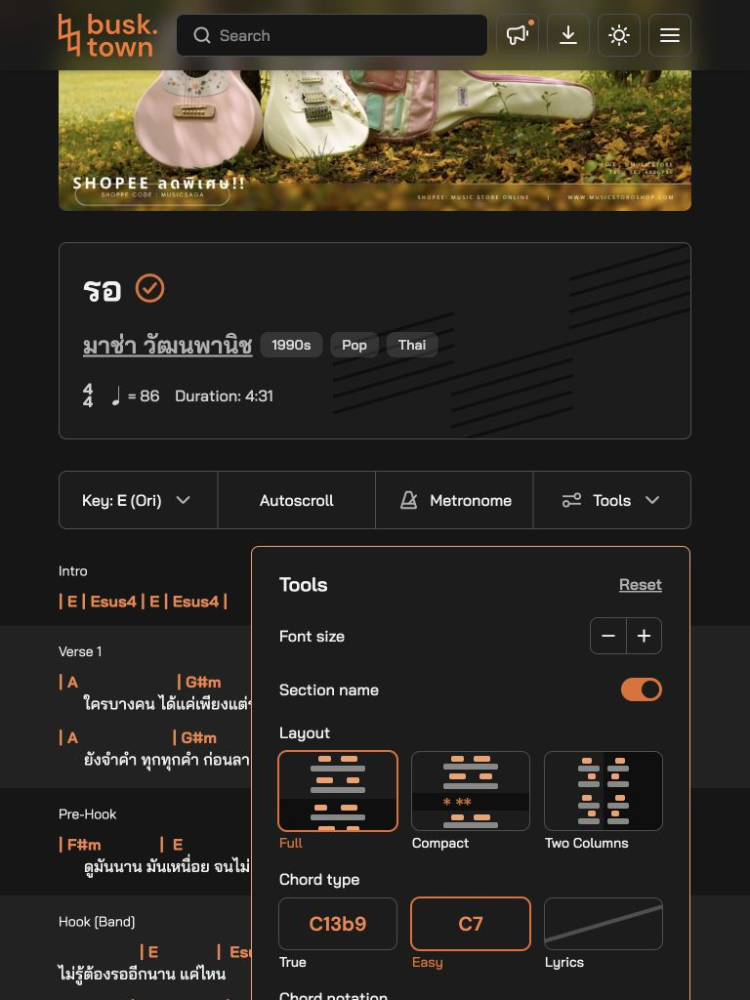

**Why it hurts:** I should not have to guess what an option means or why tapping it does nothing.

**My ask:** label Tools on phones; use “Original chords” and “Original key”; explain when a disabled option becomes available. Say “Reset display settings” if Reset does not also restore the key and stop the metronome.

### 2.3 Let me look up a chord without losing my place

**The problem:** tapping Em7 in the song does not show its fingering. A guitar chord guide exists, but reaching it takes several screens of scrolling below the music.

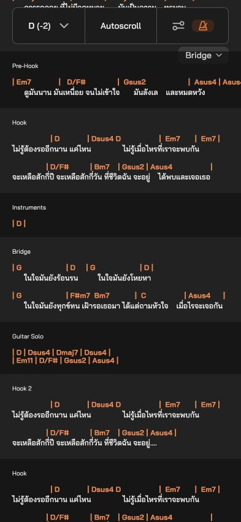 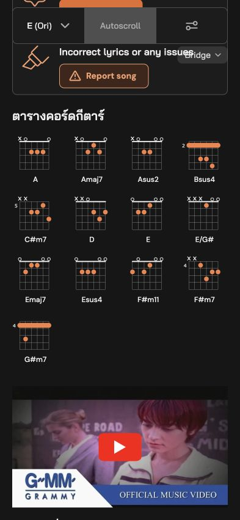

**Why it hurts:** looking up an unfamiliar shape interrupts practice and makes me find my line again.

**My ask:** let a tap on a chord open a small fingering preview in the same place. This is a convenience to add, rather than a broken chord button.

---

## P3. Finding and preparing songs

### 3.1 Find artists by the names people actually use

**The problem:** “carabao” finds nothing, while “คาราบาว” finds songs. The reverse happens with another artist: “นิวจิ๋ว” finds nothing even though their songs are listed under “NEW JIEW”.

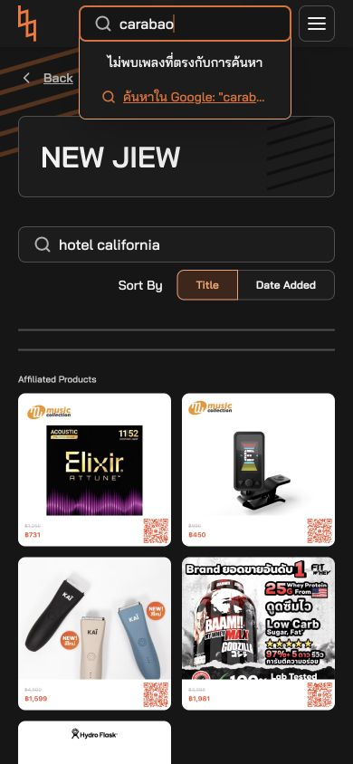 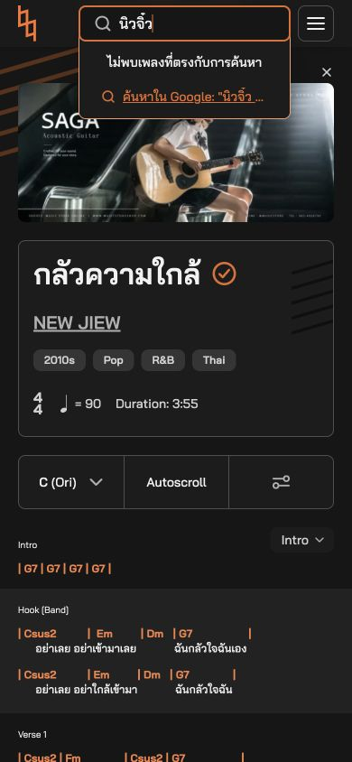

**Why it hurts:** a musician can assume the artist is missing when only the spelling is different.

**My ask:** match familiar Thai names, English names and common alternative spellings. Keep the live suggestions and typo tolerance that already work.

### 3.2 Explain an empty artist search

**The problem:** searching for “hotel california” inside NEW JIEW’s page leaves a blank song area followed by shopping cards. There is no message explaining that this search covers only that artist.

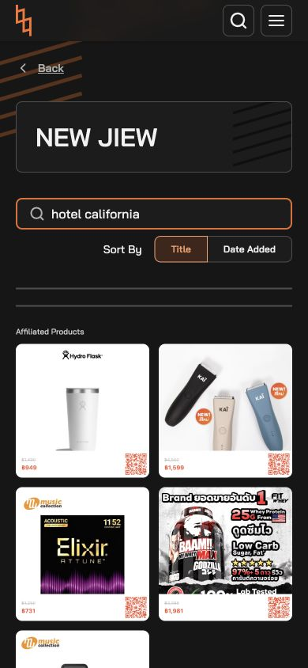

**Why it hurts:** I cannot tell whether I searched the wrong place or whether the song is missing from the whole site.

**My ask:** label it “Search NEW JIEW songs”. Show “No matching songs by NEW JIEW”, with “Search all songs” and “Clear search”.

### 3.3 Keep my search when I go back

**The problem:** after filtering an artist’s songs, opening one and pressing browser Back, the search is cleared and the whole list returns.

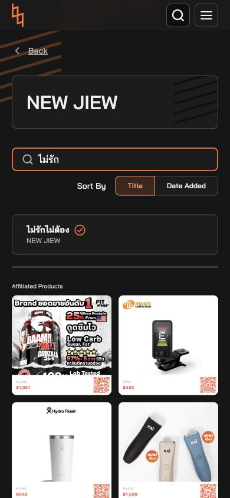 

**Why it hurts:** comparing songs for a request or rehearsal means typing the same search again.

**My ask:** restore the search, sorting and list position when returning from a song.

### 3.4 Show me where to start a setlist

**The problem:** the About page promotes free setlists and band sharing, but its invitation sends guests to the dashboard. The guest song view and menu do not explain how to start that workflow.

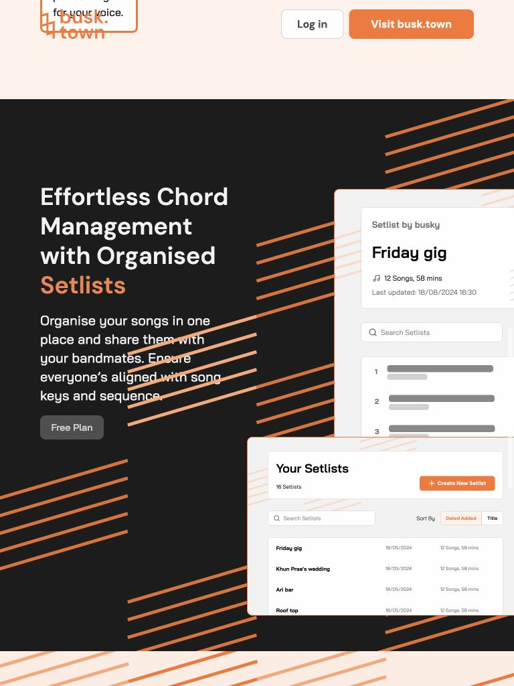

**Why it hurts:** putting ten songs in order is a normal rehearsal task, but the first step is unclear.

**My ask:** add “Create my first setlist” and “Add to a setlist”. Explain any sign-in requirement and keep the chosen song through it. The logged-in setlist tools were not tested.

---

## P4. Getting ready to use it

### 4.1 Make Sign up feel like joining

**The problem:** both “Log in” and “Sign up” lead to the same welcome-back screen, with username/password fields. The route for a new account through LINE sits underneath.

 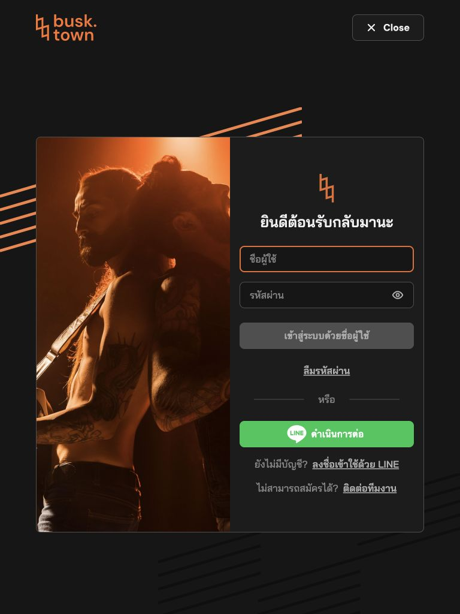

**Why it hurts:** a new player is asked for an account they do not have.

**My ask:** give Sign up a clear new-account heading and explain the available registration route before asking for credentials.

### 4.2 Tell me what will work without internet

**The problem:** the menu above offers “Install app”, but the inspected pages do not say whether installing it saves songs for a gig.

**Why it hurts:** having an app icon is not enough reassurance before going somewhere with unreliable Wi-Fi.

**My ask:** explain what installation provides. If offline saving is supported, show “Available offline” after a successful save. If internet is required, say so. Offline behavior was not tested; this is a request for clearer information.

---

## If you start with three changes

1. Keep every chord visible: fix clipping and the overlapping section picker.
2. Add a playing view and an obvious Pause button.
3. Make artist search and the first setlist easier to reach.

The aim is simple: less time figuring out the website, more time playing.

## Testing notes

Expanded on 7 October 2026 with three independent agent walkthroughs, taking a musician’s perspective. Chrome was tested at phone widths of 390–393px and a portrait tablet width of 768px; screenshots were inspected visually. These were simulated layouts, not physical iPhone/iPad tests or interviews with musicians. Account-only features, installation, offline use and metronome audio were not tested.

The earlier Thai encoding diagnosis has been removed because the visual evidence did not support it. Search offers live suggestions and handles the tested title typo; the remaining issue is artist aliases. Key settings survive reload, the song toolbar stays visible, and an enabled metronome has a visible indicator.

Images 01–12 are retained from the earlier review; 13–28 are from the additional walkthroughs. Reproduction steps and evidence: [TESTING.md](TESTING.md). Short feedback-form version: [FEEDBACK-SUMMARY.md](FEEDBACK-SUMMARY.md).
