# busk.town feedback — from a musician’s point of view

Hey busk.town team, these suggestions look at the site through an ordinary musician’s eyes: a phone or iPad on a music stand, hands on an instrument, and no interest in working out how an app works. Each point has a screenshot and a clear ask.

**The short version:**

1. **Keep every chord readable.** Ads, wide lines and floating controls get in the way of playing.
2. **Make the playing controls obvious.** Pausing the page or finding a chord shape should take one tap.
3. **Help me get a set ready.** Find artists by familiar names, keep my search when I go back, and show me how to start a setlist.

---

## The main point: let me keep playing

Once a song starts, every extra tap means taking a hand off the instrument. Give me the words, the next chord and a few controls I can recognise immediately. The rest can wait until rehearsal is over.

## Priorities at a glance

| Order | Area | What would help most |
|---|---|---|
| [P1](#p1-reading-the-song) | Reading the song | A clear playing view; lines that fit and controls that do not cover chords |
| [P2](#p2-controls-while-playing) | Controls while playing | A visible Pause button, understandable tools and nearby chord shapes |
| [P3](#p3-finding-and-preparing-songs) | Finding and preparing songs | Familiar artist names, helpful search recovery and a clear setlist entry point |
| [P4](#p4-getting-ready-to-use-it) | Getting ready to use it | A clear sign-up route and an explanation of what needs internet |

These are groups in the order I would tackle them, not a claim that every point is a critical bug.

---

## P1. Reading the song

### 1.1 Give the song more of the screen

**The problem:** a large ad sits above the song. The earlier first-visit capture also shows the Tools introduction covering the opening chords.

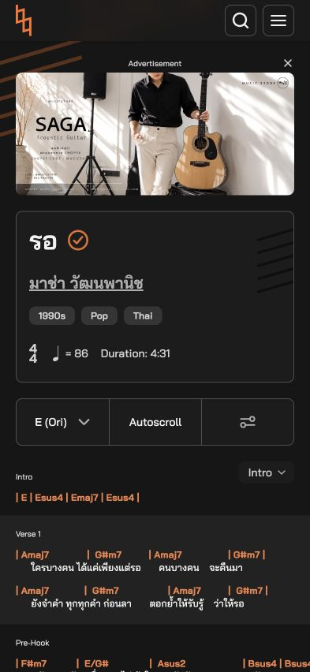 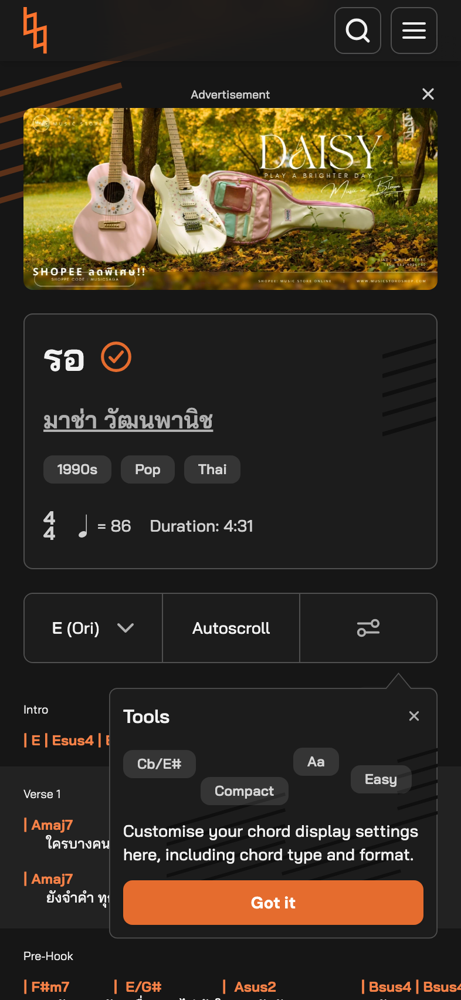

Left: current ad placement. Right: the earlier first-visit introduction; it did not reappear in the returning browser used for this recheck.

**Why it hurts:** a song link from a bandmate should open ready to play.

**My ask:** add a playing view that puts the song first and keeps ads and introductions outside the reading area. Keep recommendations and shopping below it.

### 1.2 Fit long lines to the phone

**The problem:** in *รอ*, Full layout, original key E and default text size, the final Bsus4 in the Pre-Hook is partly outside the phone view. Scrolling sideways reveals it, but there is no clear cue to do that.

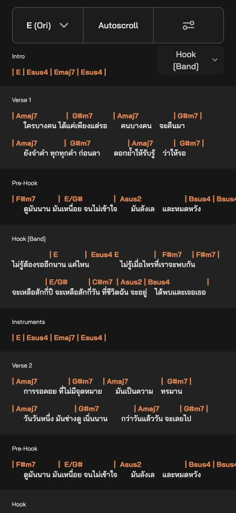 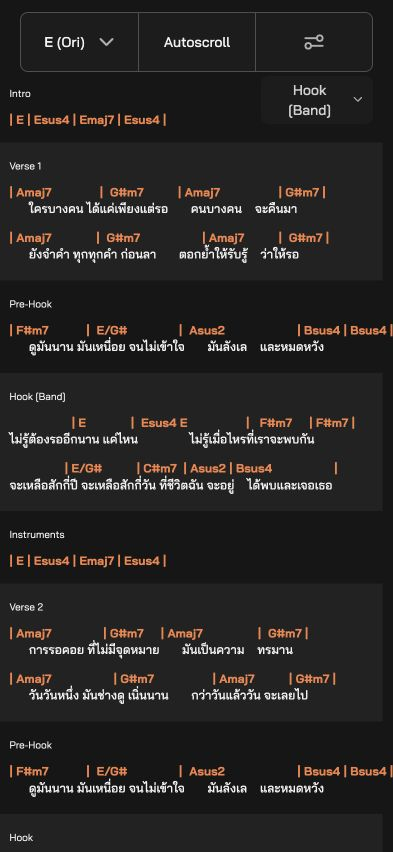

Left: initial view. Right: after scrolling sideways, with the same song and settings. The chord is reachable.

**Why it hurts:** reading one line should not need an extra gesture while playing.

**My ask:** wrap the line or fit its bars to the screen automatically, including after increasing the text size.

### 1.3 Keep the section picker off the music

**The problem:** while scrolling through *รอ*, the floating “Bridge” picker overlaps the last chord and the end of a lyric in Verse 2. This happens even to content that fits on the screen.

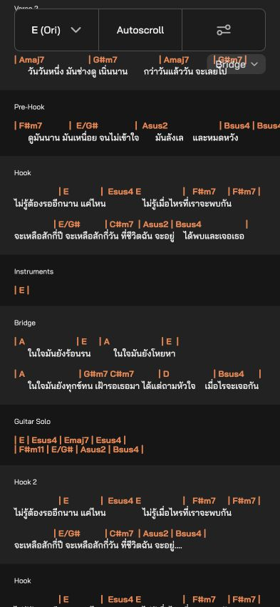

**Why it hurts:** looking up for the next chord should not mean moving the page to uncover it.

**My ask:** give the picker its own space beside the toolbar, clear of the chords and lyrics.

---

## P2. Controls while playing

### 2.1 Show me how to pause Autoscroll

**The problem:** starting Autoscroll replaces its label with “60%”, “100%” and “150%”. Tapping the selected percentage pauses it, but nothing on screen says that.

 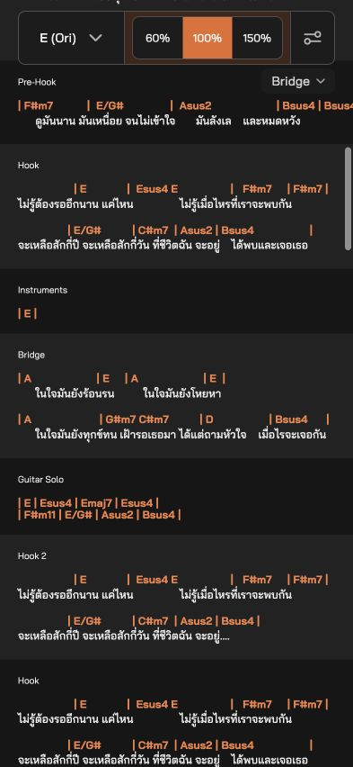 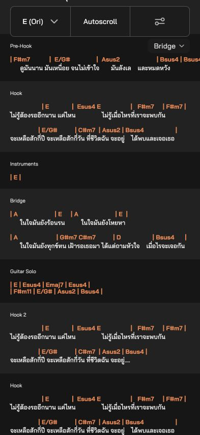

Before → running → paused after tapping the highlighted 100%. Pausing works; the action needs a clearer label.

**Why it hurts:** if the singer repeats a line or talks to the audience, I need to stop the page immediately.

**My ask:** keep a labelled Pause/Resume button beside the speed choices.

### 2.2 Make the tools explain themselves

**The problem:** the phone’s Tools control is an icon without a visible name. Inside it, “True” is an unclear name for a chord version; the key selector abbreviates “Original” to “Ori”.

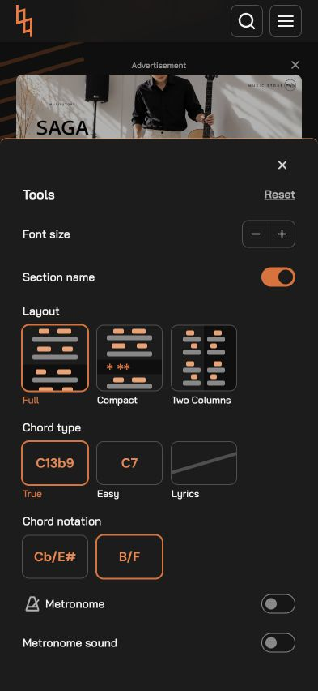

The toolbar icon and “E (Ori)” are visible in the fresh song screenshot in 1.1. The Section name switch works when clicked; the earlier claim that it could not be changed has been removed.

**Why it hurts:** I should not have to guess what an option means.

**My ask:** label Tools on phones and use “Original chords” and “Original key”.

### 2.3 Let me look up a chord without losing my place

**The problem:** tapping F#m7 in *รอ* does not show its fingering. A guitar chord guide exists, but reaching it takes several screens of scrolling below the music.

 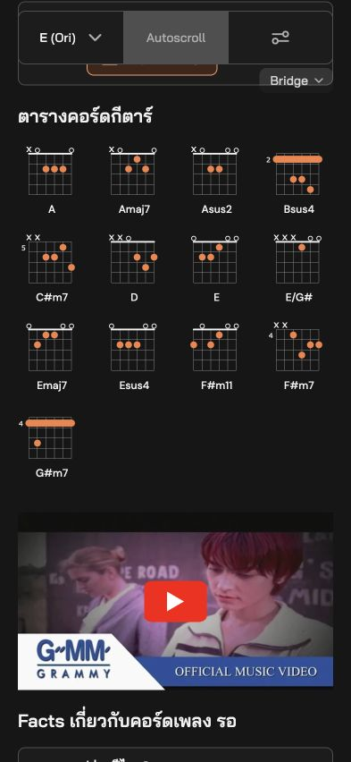

Left: after the tap. Right: the existing guide, with F#m7 in its third row on the right. Both use original key E and the same display settings.

**Why it hurts:** looking up an unfamiliar shape interrupts practice and makes me find my line again.

**My ask:** let a tap on a chord open a small fingering preview in the same place. This is a convenience to add, rather than a broken chord button.

---

## P3. Finding and preparing songs

### 3.1 Find artists by the names people actually use

**The problem:** “carabao” finds nothing, while “คาราบาว” finds songs. The reverse happens with another artist: “นิวจิ๋ว” finds nothing even though their songs are listed under “NEW JIEW”.

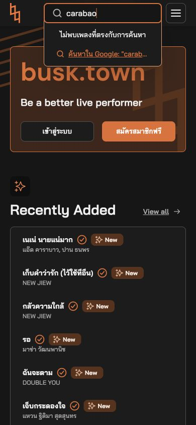 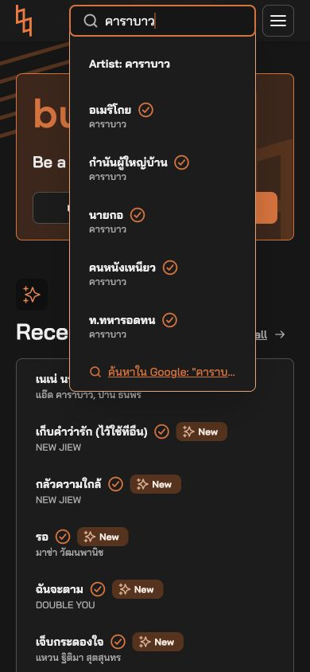

“carabao” → no matches; “คาราบาว” → artist and songs.

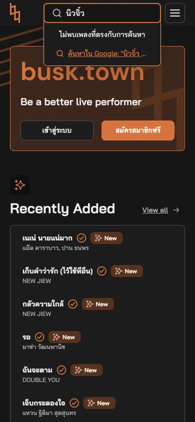 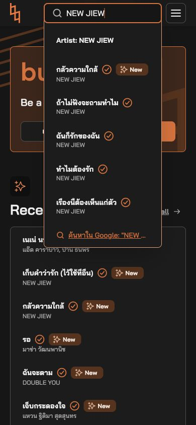

“นิวจิ๋ว” → no matches; “NEW JIEW” → artist and songs. All four captures use the dashboard’s main search.

**Why it hurts:** a musician can assume the artist is missing when only the spelling is different.

**My ask:** match familiar Thai names, English names and common alternative spellings. Keep the live suggestions and typo tolerance that already work.

### 3.2 Explain an empty artist search

**The problem:** searching for “hotel california” inside NEW JIEW’s page leaves a blank song area followed by shopping cards. There is no message explaining that this search covers only that artist.

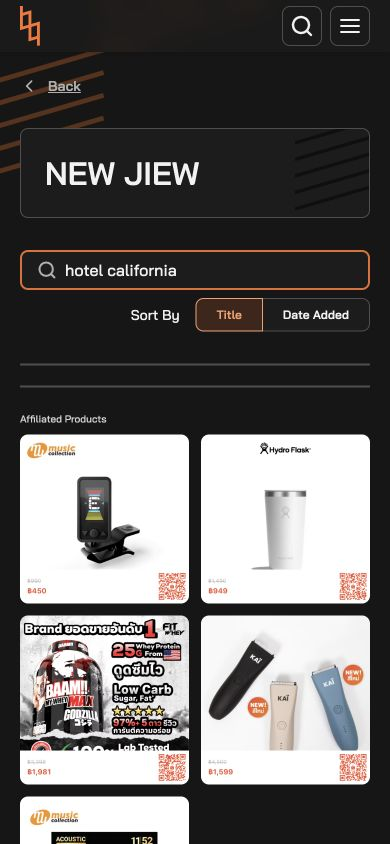

**Why it hurts:** I cannot tell whether I searched the wrong place or whether the song is missing from the whole site.

**My ask:** label it “Search NEW JIEW songs”. Show “No matching songs by NEW JIEW”, with “Search all songs” and “Clear search”.

### 3.3 Keep my search when I go back

**The problem:** after searching NEW JIEW’s songs for “ไม่รัก”, choosing Date Added, opening a result and pressing browser Back, the search clears and sorting returns to Title.

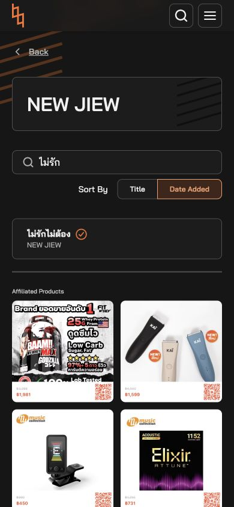 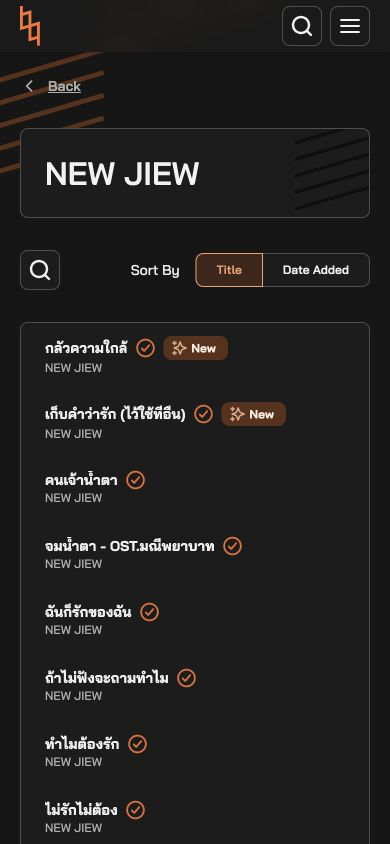

**Why it hurts:** comparing songs for a request or rehearsal means typing the same search again.

**My ask:** restore the search, sorting and list position when returning from a song.

### 3.4 Show me where to start a setlist

**The problem:** the About page promotes free setlists and band sharing, but clicking “Visit busk.town” in its joining invitation sends a guest to the dashboard. The guest dashboard, menu and song tools checked here do not explain how to start a setlist.

 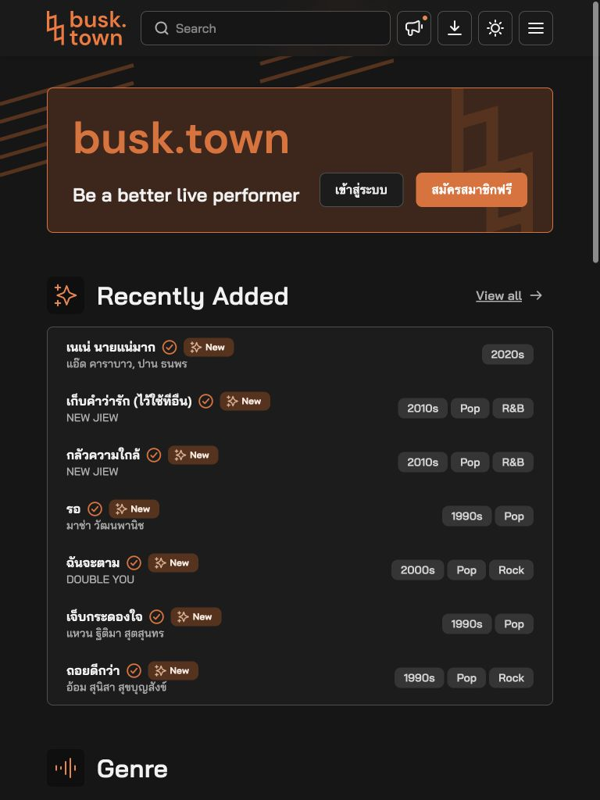

Left: the invitation before clicking. Right: its actual destination, scrolled to the top for context. [Setlist promotion](images/recheck-parent-01-about-setlist-promise.jpg) · [Immediate landing capture](images/recheck-parent-03-invitation-opens-dashboard.jpg).

**Why it hurts:** putting ten songs in order is a normal rehearsal task, but the first step is unclear.

**My ask:** add “Create my first setlist” and “Add to a setlist”. Explain any sign-in requirement and keep the chosen song through it. The logged-in setlist tools were not tested.

---

## P4. Getting ready to use it

### 4.1 Make Sign up feel like joining

**The problem:** clicking “Sign up” opens the same welcome-back screen linked by “Log in”, with username/password fields first. A new-account route through LINE is present underneath.

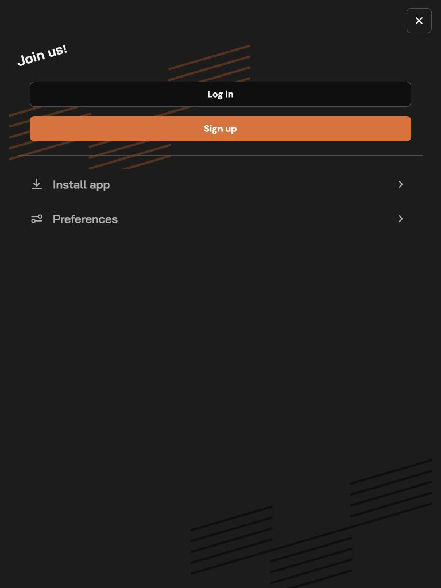 

**Why it hurts:** a new player is asked for an account they do not have.

**My ask:** give Sign up a clear new-account heading and explain the available registration route before asking for credentials.

### 4.2 Tell me what will work without internet

**The problem:** the menu above offers “Install app” without explaining whether installation saves songs for a gig.

**Why it hurts:** having an app icon is not enough reassurance before going somewhere with unreliable Wi-Fi.

**My ask:** explain what installation provides. If offline saving is supported, show “Available offline” after a successful save. If internet is required, say so. Offline behavior was not tested; this is a request for clearer information.

---

## If you start with three changes

1. Keep every chord visible: fit long lines and move the overlapping section picker.
2. Add a playing view and an obvious Pause button.
3. Make artist search and the first setlist easier to reach.

The aim is simple: less time figuring out the website, more time playing.

## Testing notes

Expanded and rechecked on 7 October 2026. The original expansion used three independent agents; this evidence recheck used two agents plus the primary reviewer. Chrome was tested at phone widths of 390–393px and a portrait tablet width of 768px. These were simulated layouts, not physical iPhone/iPad tests or interviews with musicians. Account-only features, installation, offline use and metronome audio were not tested.

The recheck replaced a wrong-song clipping image and mismatched chord-help and Back-navigation pairs. Horizontal scrolling does reveal the last chord, and Section name does work; the claims have been corrected. The earlier Thai encoding diagnosis remains withdrawn.

Every current screenshot was inspected against its caption. Except for the explicitly labelled first-visit capture, the images used above are fresh from this recheck. Actions were checked live; a still image alone cannot prove a click, pause or navigation. [Screenshot audit](SCREENSHOT-CHECK.md) · [Reproduction steps](TESTING.md) · [Short feedback-form version](FEEDBACK-SUMMARY.md).
