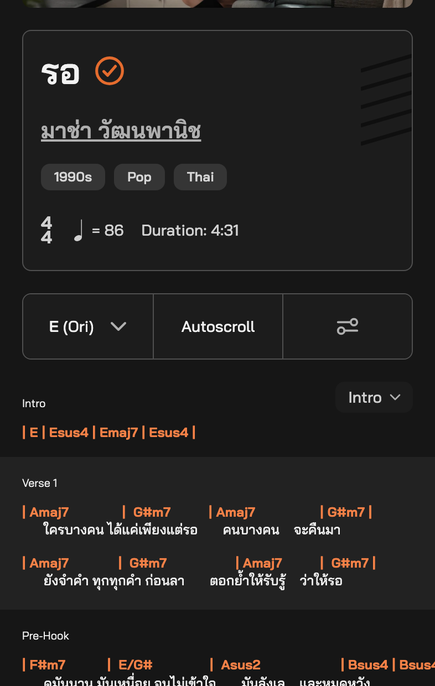
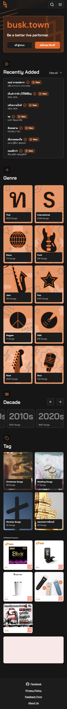

# UX / UI Review — [busk.town](https://busk.town)

**For musicians with no tech background, on phones & iPads — at rehearsal and live on stage.**
Tested logged-out in Chrome emulating an iPhone (393×852) and iPad portrait (834×1194), plus DOM measurements. Independent reviewer; single-reviewer feedback, not an audit.

## TL;DR

The **chord viewer core is great** — chords over lyric syllables, labeled sections, and a powerful Tools panel. The problems are *around* it: **ads and dialogs eat the playing screen, chord lines clip off the phone edge, search misses obvious queries, and Thai text renders misspelled.** For a product promising *"Chords You Can Trust"*, these break trust at the moment of performance.

## ✅ What works — keep it

  

- Chords aligned syllable-perfect over lyrics; orange-on-dark = stage-readable (left).
- Tools sheet has everything gigging musicians want: transpose, autoscroll, metronome, Easy chords, font size, layouts (middle).
- Song facts up top (key, BPM, time sig, duration) · press-and-hold to report wrong lyrics · clean genre/decade/wedding-tag discovery (right) · LINE login fits Thailand.

## 🔧 Issues, prioritized

### P1 · Ads dominate the screen musicians play from

  

Top ad takes ~40% of the phone's first screen above the song; on iPad it pushes chords below the fold. Below the song: a second ad (sometimes an empty black box), two related lists, chord grid, FAQ, video, Shopee ad wall — a 12,000px scroll.
**Fix:** ad-free "stage mode" inside the song view; collapse the top ad.

### P1 · Chord lines clip off the right edge — unreachable

Measured: a 5-bar line is **384px wide in a 353px container with no horizontal scroll** — the last chord is cut mid-glyph. On stage, musicians can't swipe to a clipped chord.
**Fix:** auto-wrap / auto-Compact wide lines under ~420px. Never clip chords.

### P1 · Thai text renders misspelled (UI *and* lyrics)

Tone marks appear out of order or added spuriously — song titles, login buttons, cookie banner (screens above). It's in the page source, so it's likely an encoding/transliteration bug, not a font quirk. For a lyrics product, this is a trust-killer.
**Fix:** audit the text pipeline (TIS-620↔Unicode, NFC) + native-speaker QA.

### P1 · Search misses songs that exist

Searching **"carabao"** — Thailand's most famous band, whose songs sit on the same dashboard — returns "not found".
**Fix:** match romanized/alias spellings + live suggestions. (Google fallback: nice touch.)

### P2 · First-visit dialog pile-up · hidden controls · cryptic words

- Cookie modal + an onboarding popover open **over the first chords** on first visit (see P1 image left). → non-blocking toasts.
- Phone: Tools = unlabelled icon, **Metronome disappears** into the Tools sheet (iPad has it labelled). → keep visible & labelled.
- "E (Ori)", "(+5)", chord type "**True**" need explaining. → "Original key", "+5 semitones", "Original chords".
- After the song, actions (add-to-setlist, next song) are buried under the SEO tail. → sticky mobile bottom bar.

### P3 · Polish

 

- No *Continue with Apple/Google*; "can't register? contact the team" dead-ends non-tech users.
- Landing shows grey skeleton bars inside its chord animation (left); CTA says "Visit busk.town" while already there — make it "Search a song"; English landing vs Thai app.
- "Install app" (offline!) is hidden in the menu — surface it; venue Wi-Fi is unreliable.

## 🙋 Top-8 quick wins

1. Stage mode: no ads in the song view · 2. Never clip chord lines on phones · 3. Fix Thai text encoding · 4. Romanized-name search + suggestions · 5. Non-blocking first-run dialogs · 6. Label phone controls, restore Metronome button · 7. Plain words: "Original key / Original chords" · 8. Apple sign-in + visible "Install app".

---

*Captured Oct 2026 · logged-out · Chrome iPhone/iPad emulation. All screenshots in `images/`. Paste-ready text for the feedback form: [`FEEDBACK-SUMMARY.md`](FEEDBACK-SUMMARY.md).*
