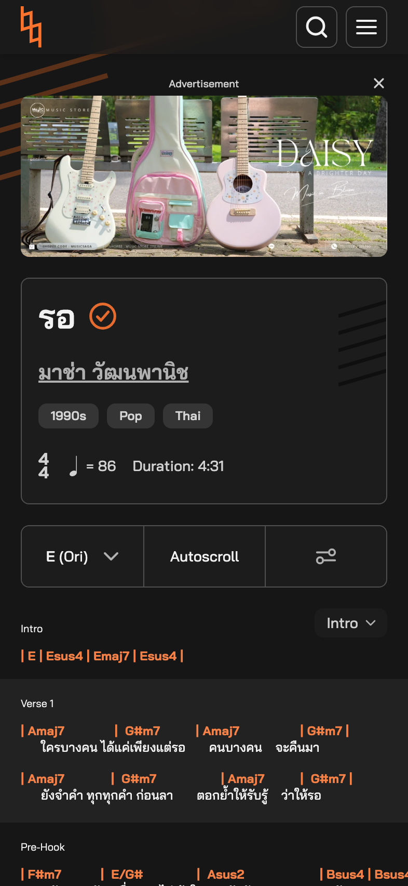
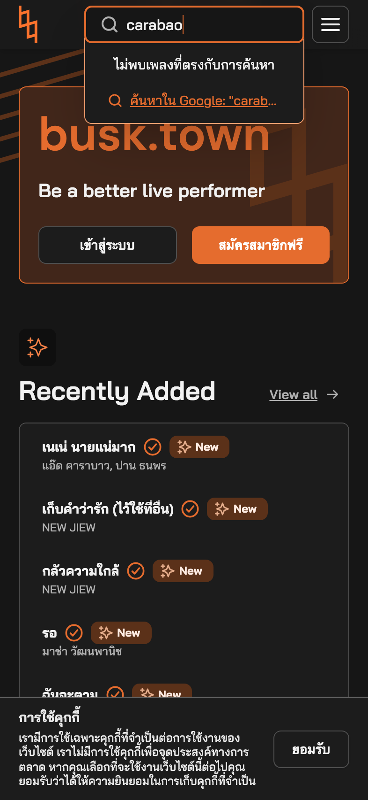
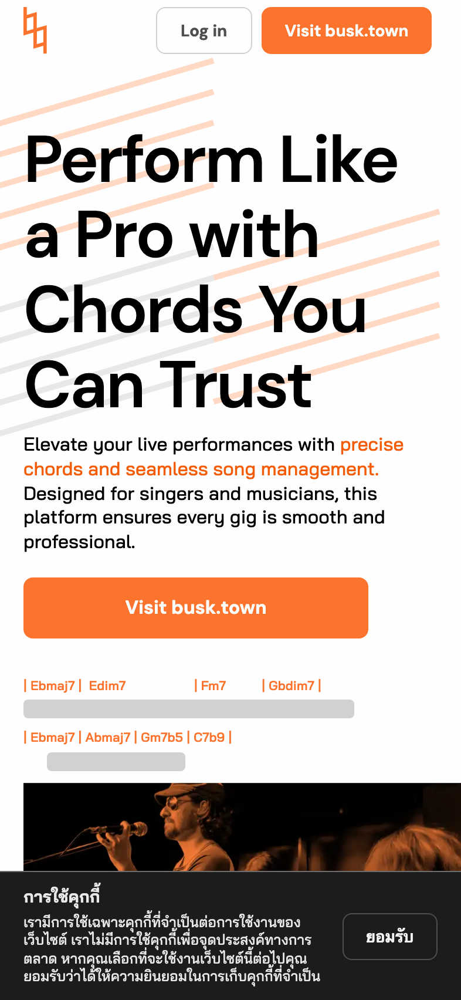
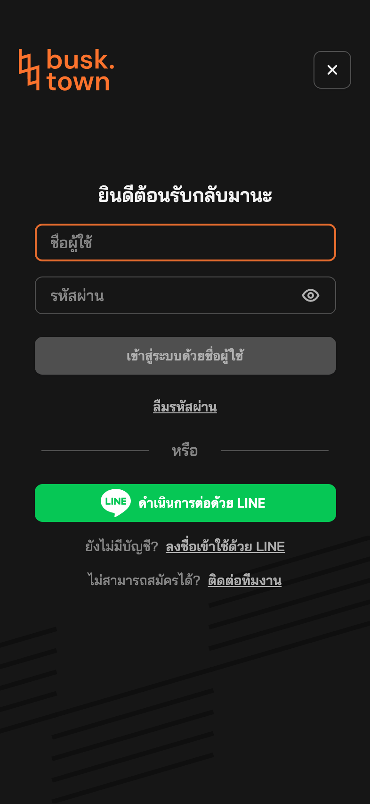

# A UX review of busk.town — from a musician on a phone

This review looks at busk.town the way most players with no tech background actually use it: an iPhone or iPad propped on an amp, reading chords and lyrics, sometimes one-handed while tuning, usually in a dim venue.

What I did: browsed logged-out in Chrome with an iPhone (393px wide) and an iPad (portrait) simulated, and measured a few things in the page itself. Screenshots are in `images/`. One person's feedback, not a formal audit.

The short version: the song view is genuinely good. Chords sit over the right syllables, sections are labelled, and the tools menu covers nearly everything I'd want on stage. The problems are all the things *around* that view — ads eating the space I play from, a chord bar cut off at the edge of my phone, a search that doesn't know Carabao, and Thai text that renders like it went through a broken converter. That's what I'd work on, in the order I'd care about it.

## 1. Ads crowd out the song

  

When I open a song on my phone, an ad takes about 40% of the first screen before the title even starts. On the iPad it's worse — the actual chords begin below the fold. Below the song there's another ad (sometimes just an empty black box), then two "you might also like" lists, a chord grid, an FAQ accordion, a video embed and a wall of Shopee products — the whole page is over 12,000px of scroll for a four-minute song. The song itself is maybe the first third.

What would help: a stage or performance view with no ads inside the song, or at minimum shrink the top ad to a slim banner and keep the empty ad slot from showing at all.

## 2. A chord bar gets clipped, and I can't scroll to it

I measured the widest line in the song I tested — five bars, `F#m7 | E/G# | Asus2 | Bsus4 | Bsus4` — at 384px wide inside a 353px container, with nothing scrollable at that width. The last chord was cut clean in half at the screen edge. On stage that's not a styling nit, it's an unreachable chord.

What would help: under roughly 420px, wrap long lines automatically or fall back to the Compact layout. Chords should never be cut off.

## 3. The Thai text looks misspelled in all the wrong places

It isn't just a font quirk — the broken characters show up in the raw page text too. Tone marks land before the consonant they belong to, or extra ones appear where none should: song titles like "รอ", the login and sign-up buttons, even the cookie notice all read like they went through a broken converter. For a product whose promise is accurate, trusted lyrics, this is the one bug that makes players stop trusting the data on stage.

What would help: check how text flows through the content pipeline (the TIS-620 / Unicode conversions, NFC normalisation), and have a native Thai speaker sign off on the UI strings and a sample of lyrics.

## 4. Search doesn't find the obvious songs

I searched for `carabao` — the most famous band in Thailand, with songs sitting right there on the dashboard I searched from — and got nothing. It seems to match only the exact Thai display text. The fallback link to Google is a nice touch, but it shouldn't be needed for this.

What would help: match romanised and alternate spellings (carabao → คาราบาว) and show results while you type.

## 5. Small things that add up on stage

- On a first visit, the cookie modal covers a third of the landing page and the first-visit tooltip pops up over the opening chords. When a singer texts me a song link, I want it to open straight onto the chords.
- On the phone, the Tools button is a slider icon with no label, and the metronome only lives inside that sheet — I didn't believe it existed until I went looking (the iPad toolbar shows both, labelled). Keep them visible on phone too.
- "E (Ori)", "(+5)" and the chord type called "True" all made me stop and think. On stage, plain words win: "Original key", "+5 semitones", "Original chords".
- After the song ends, the useful actions — add to setlist, get to the next song — vanish under the SEO clutter. A slim sticky bar at the bottom would fix this.

## 6. The rest

 

- Login is username/password or LINE only. Plenty of iPhone musicians lean on Continue with Apple far more than on remembering a password, and "can't register? contact the team" is the kind of dead end that quietly loses sign-ups.
- The landing page shows grey skeleton bars inside its animated chord marquee, which reads as unfinished; and the main button says "Visit busk.town" while you're already there — "Search a song" would be a better call. The landing is in English while the app is in Thai; my bandmates who read Thai would be happier with Thai throughout.
- There's an "Install app" option buried in the menu. Venue wifi dies constantly — making installing obvious is how busk.town becomes the app nobody dares leave at home.

## If you only have time for a few of these

1. Hide the ads inside the song view (a stage mode).
2. Never let a chord be clipped on phones.
3. Fix the Thai text pipeline and have a native speaker check it.
4. Teach search to understand romanised band names.
5. Stop the first-run dialogs from covering the chords.
6. Label the phone controls, and bring the metronome back.
7. Rename "E (Ori)" and "True" to plain words.
8. Add Continue with Apple, and make installing the app visible.

For what it's worth: the viewer itself is close to the best I've played from on a phone. The fixes are all around it, and I'd happily retire my printed setlist for it once they're in.

---

Captured Oct 2026, logged-out, Chrome iPhone/iPad emulation. All screenshots in `images/`. Paste-ready text for their feedback form: [`FEEDBACK-SUMMARY.md`](FEEDBACK-SUMMARY.md).
